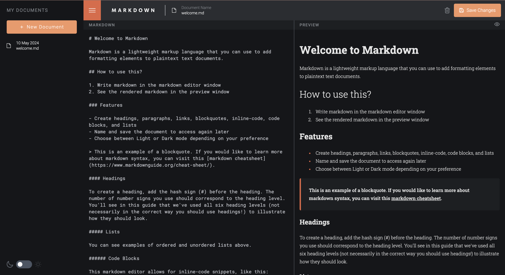

# Inline Markdown Editor

This is a solution to the [In-browser markdown editor challenge on Frontend Mentor](https://www.frontendmentor.io/challenges/inbrowser-markdown-editor-r16TrrQX9). Frontend Mentor challenges help you improve your coding skills by building realistic projects.

## Table of contents

- [Overview](#overview)
  - [Functional Requirements](#functional-requirments)
  - [Screenshot](#screenshot)
  - [Links](#links)
  - [Failed express version](#failed-express-version)
- [My Process](#my-process)
  - [Built with](#built-with)
- [Setup](#setup)
- [Continued Development](#continued-development)
- [Author](#author)

## Overview

### Functional Requirments

Users should be able to:

-The user must be able to search for cities from both the home screen and the weather
results screen.

- Create, Read, Update, and Delete markdown documents
- Name and save documents to be accessed as needed
- Edit the markdown of a document and see the formatted preview of the content
- View a full-page preview of the formatted content
- View the optimal layout for the app depending on their device's screen size
- See hover states for all interactive elements on the page

### Screenshot



### Links

- Solution URL: [Github](https://github.com/okori97/markdown-editor)
- Live site URL: [Vercel site](https://markdown-editor-sable.vercel.app/)

#### Failed express version

I botched the deployment of an express version of this app, but i'm happy to share it if anyone is interested. It's a bit more complex than the nextjs version, but it's still a good example of how to use express and node, and has testing and mocking in place.

- Extra: Express version: [Github](https://github.com/okori97/full-stack-markdown-editor)

## My process

### Built with

- Typescript
- Nextjs
- Tailwindcss
- Drizzle
- ReactMarkdown
- Postgres
- eslint

## Setup

Make sure to install the dependencies:

```bash
# npm
npm install

# pnpm
pnpm install

# yarn
yarn install

# bun
bun install
```

### Continued development

I would like to add more feedback, such as success and error toasts when files are saved and deleted. I also would have maybe added a search bar to the home screen to search for documents and a tagging system to allow users to tag documents. I certainly would like to create a loading screen for when the app is fetching data from the server.

## Author

- Website - [Okori Lewis-McCalla](https://www.okori.com)
- Frontend Mentor - [@okori97](https://www.frontendmentor.io/profile/okori97)
- Twitter - [@onlyokori](https://www.twitter.com/onlyokori)
